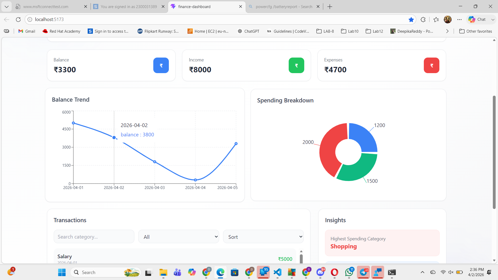
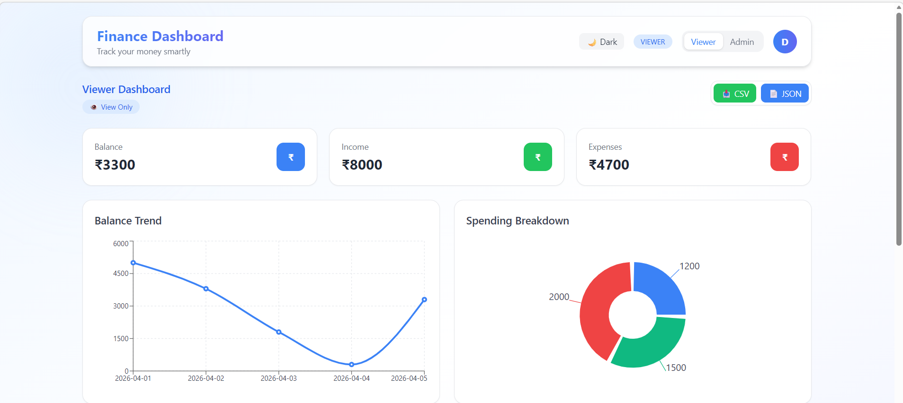
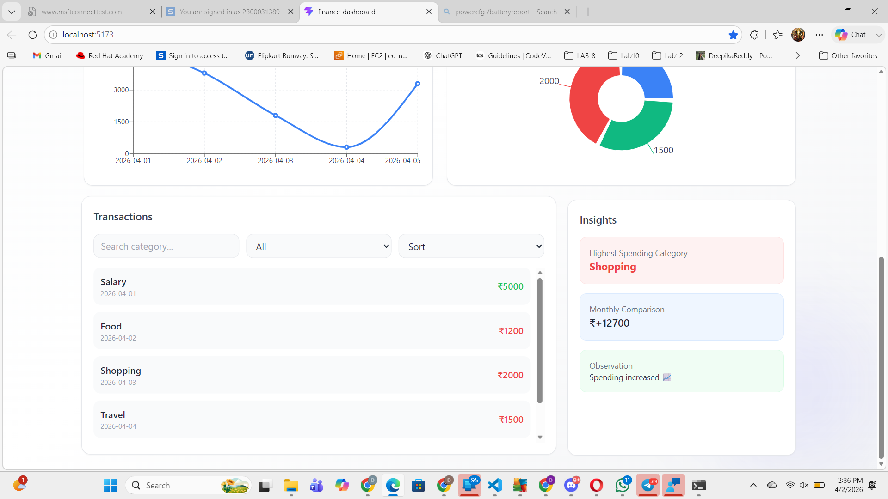
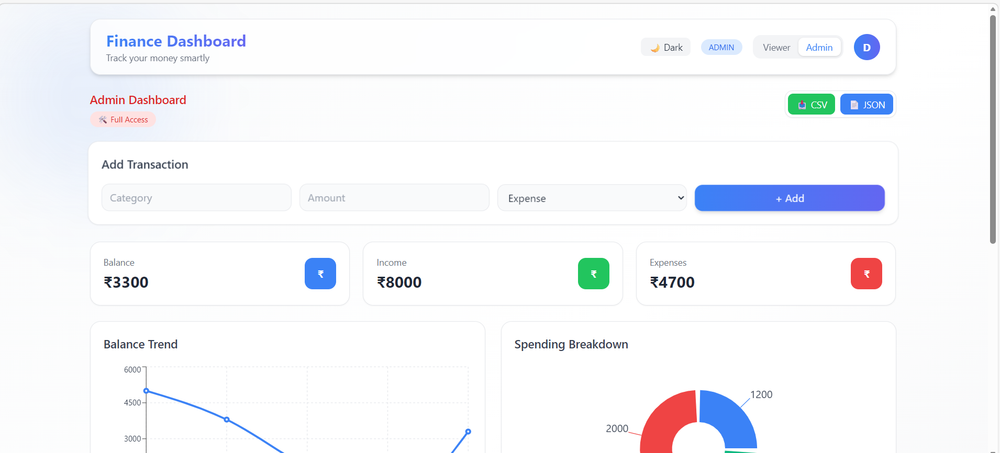
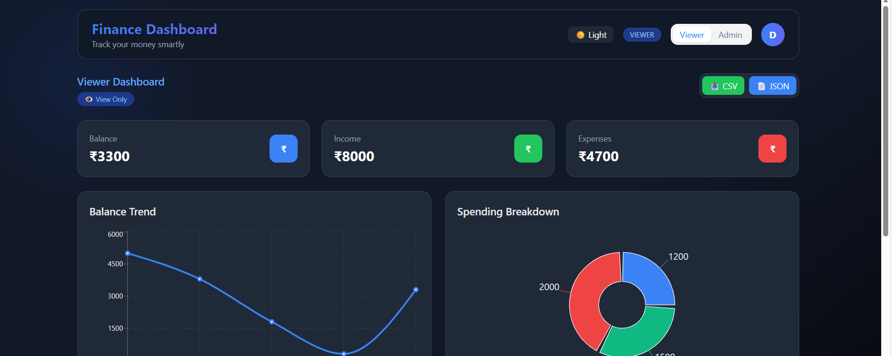

# 💰 Finance Dashboard UI

## 📌 Overview

The Finance Dashboard UI is a responsive and interactive web application built using React and Tailwind CSS.  
It enables users to monitor financial activity, analyze spending patterns, and manage transactions efficiently through a modern and intuitive interface.

> 🚀 Built with a focus on scalability, clean UI/UX, and real-world financial data interaction.

This project emphasizes frontend architecture, reusable components, and effective state management using the Context API.

---

## 🧠 Approach

The application follows a modular, component-driven architecture to ensure scalability, reusability, and maintainability.

### Key Design Decisions:

- **Component-Based Architecture**
  - Reusable components such as Navbar, Summary Cards, Charts, and Transaction List

- **Centralized State Management**
  - Implemented using React Context API to manage:
    - Transactions
    - Filters
    - User roles (Admin / Viewer)
    - Theme (Dark / Light)

- **Mock Data Simulation**
  - Static data is used to replicate real-world financial transactions

- **Separation of Concerns**
  - Organized code into structured folders for UI, logic, and data handling

---

## 🚀 Features

### 📊 Dashboard Overview
- Real-time summary of Total Balance, Income, and Expenses
- Balance Trend visualization using Line Chart
- Spending Breakdown using Pie Chart

---

### 💳 Transactions Section
- View transaction details:
  - Date
  - Category
  - Amount
  - Type (Income / Expense)

- Advanced Features:
  - Search by category
  - Filter by type (Income / Expense)
  - Filter by amount range
  - Sort transactions by amount

---

### 👥 Role-Based UI

- **Viewer**
  - Read-only access
  - Blue-themed interface

- **Admin**
  - Add and manage transactions
  - Full access control
  - Red-themed interface

---

### 📈 Insights
- Highest spending category detection
- Monthly financial comparison
- Smart observations based on transaction data

---

### 🌙 Dark Mode
- Toggle between Light and Dark themes
- Fully responsive and consistent UI across themes

---

### 📥 Export Functionality
- Export transaction data as:
  - CSV
  - JSON

---

### ✨ UI/UX Enhancements
- Smooth animations and transitions
- Clean and modern design
- Fully responsive across desktop, tablet, and mobile devices

---

## 🛠️ Tech Stack

- React.js  
- Tailwind CSS  
- Recharts  
- Context API  

---

## 📂 Project Structure

```
src/
│── components/
│   ├── common/
│   ├── cards/
│   ├── charts/
│   ├── transactions/
│   ├── insights/
│   ├── admin/
│
│── pages/
│   ├── ViewerDashboard.jsx
│   ├── AdminDashboard.jsx
│
│── context/
│   ├── AppContext.jsx
│
│── data/
│   ├── mockData.js
```

---

## 📸 Screenshots

 
- Dashboard View  

- Viewer Panel

- Transactions Page  

- Admin Panel

-Dark mode


---

## ⚙️ Setup Instructions

### 1. Clone the repository
```bash
git clone <your-repo-link>
```

### 2. Navigate to the project folder
```bash
cd finance-dashboard
```

### 3. Install dependencies
```bash
npm install
```

### 4. Run the project
```bash
npm run dev
```

---

## 🌐 Live Demo

🔗 https://your-live-link.com  

*(Deploy using Vercel or Netlify and paste your link here)*

---

## 📱 Responsiveness

- Fully responsive design  
- Optimized for desktop, tablet, and mobile devices  

---

## 💡 Highlights

- Clean and modular architecture  
- Role-based UI design  
- Interactive charts and insights  
- Real-time filtering and sorting  
- Dark mode support  
- Export functionality  

---

## 🔮 Future Improvements

- Backend integration  
- Authentication system  
- Date range filtering  
- Persistent database storage  
- Export filtered data  

---

## 👩‍💻 Author

**Deepika Reddy**  
- Frontend Developer  
- Passionate about UI/UX and scalable web applications  

---

## 📜 Note

This project is developed for frontend evaluation purposes and demonstrates UI design, component structuring, and state management.